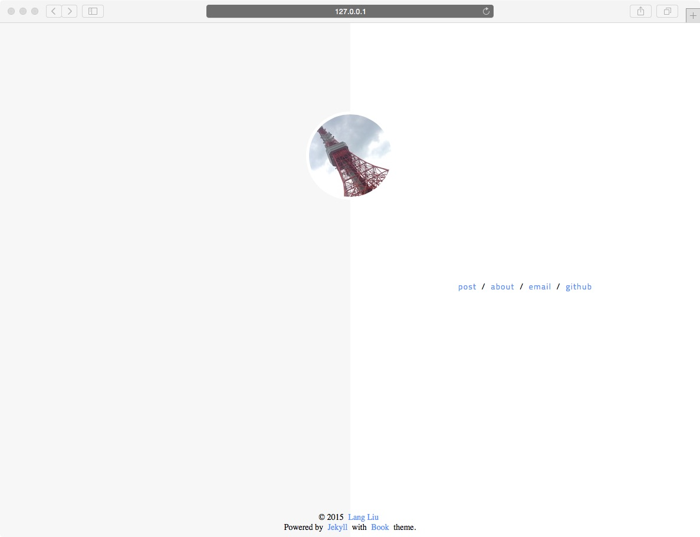

Book
====

Book is a simple Jekyll theme like a real book. [Demo]()

### Screenshots

### Features

* Responsive layout and mobile first
* Customized [404]() page
* Timeline style for post archive

### Get started

1.  fork the [repo](https://github.com/kkninjae/book/fork).
2.  clone `git clone https://github.com/username/book`
3.  run `jekyll serve -w`

[http://localhost:4000](http://localhost:4000) should be ready.

Customization
-------------

### _config.yml file

* title: site name
* description: site description
* url: site url
* avatar: absolute path of avatar which is a picture (140px * 140px) on the index page.
* favicon: absolute path of site favicon
* google_analytics: id for google analystics
* disqus_shortname: shortname of disque comment system
* about: content on the about page.
  you can write more than one paragraph but the format should be like the original one.
  the special word `?link?` will be replaced by one of the links which are listed under links.

### warning

Please do not delete the first two lines of style.css file.

Open Sources
------------

* [Google Fonts](https://www.google.com/fonts)
* [jQuery](https://jquery.com/)
* [highlight.js](https://highlightjs.org/)

License
-------

[MIT](./LICENSE)
